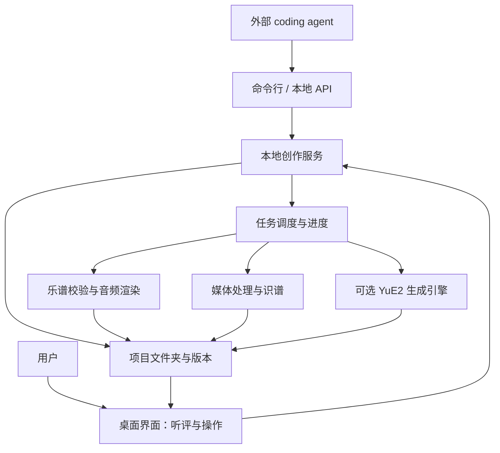

# Music Room 桌面客户端：产品设计与技术架构

状态：目标方案，尚未开发；用于后续开发拆轮与验收。

日期：2026-10-08。

范围：首发 macOS / Apple Silicon，本地创作服务为核心，桌面 UI 与外部 agent 为两种调用入口。Windows / Linux 保留架构扩展空间，本方案不宣称已经支持。

入口：[项目 README](../../README.md)。现有网页能力见 [音乐工作台](music-workbench.md)；现有创作 JSON 契约见 [独立创作说明](../../src/music/authoring/README.md)。

## 1. 结论与边界

### 1.1 产品形态

Music Room 是一款让用户与 agent 协作创作音乐的本地桌面工具。用户先听短片段，给反馈，再发展成整曲；同一项目保留多个版本、来源文件、乐谱和音频。

**核心是本地创作服务。** 服务负责项目、版本、任务、音乐引擎、产物保存及 agent 接口。UI 负责呈现和试听，通过服务操作项目。外部 agent 通过命令行或本地 API 完成主要工作，无需操纵界面，也无需拥有客户端全部源码。



### 1.2 已确定的方向

- 一首作品对应一个创作项目；项目内有多个版本。作品库聚合项目。第一阶段不引入专辑、多人协作和云端账户。
- 长期数据保存在普通项目文件夹，能独立备份、复制和交给 agent；浏览器存储退出主数据职责。
- 乐谱版本和音频版本都成立。音频可以直接播放和比较，不强制转成 MIDI。
- 创作语言不受限。Agent 可用 JavaScript、Python 或其他语言写曲子，交付约定的文件。
- 默认无云端后台、无收费模型 API；本地服务和本地模型可以存在。下载程序/模型与上传用户作品是不同操作。
- 基础客户端可以在未安装生成模型时使用。各引擎缺失只影响相关任务。
- 不把音符数量、校验通过、模型成功输出或技术评分当作“好听”的证明；审美判断由用户试听完成。

### 1.3 尚需实测的事项

| 项目 | 当前决定 | 待验证内容 |
| --- | --- | --- |
| 桌面运行时 | Electron | 当前 Web Audio 播放、循环和离线渲染在其固定 Chromium 版本中的实际表现 |
| 首期识谱 | Basic Pitch | 真实独奏/哼唱片段的错音、漏音与节奏误差，不承诺全曲多轨还原 |
| 本地生成 | 可选 YuE2 / MLX 适配器 | 用户机器的纯器乐质量、短片段/扩写服从度、速度、峰值内存及可重复性 |
| 应用内 agent | 暂不建设 | 若需要再明确模型来源、费用、用户授权和任务边界 |
| 跨平台 | 后续独立验收 | 媒体工具、渲染器和各模型在对应平台上的能力，不按“能打包”推断可用 |

用户当前的创作与听评需求是产品依据；尚无其他用户访谈或市场验证。这里不替其他用户群作需求结论。

## 2. 产品设计

### 2.1 核心对象

| 对象 | 用户理解 | 必须保存的内容 |
| --- | --- | --- |
| 项目 | 正在创作的一首作品 | 身份、名称、创作要求、默认版本、版本目录 |
| 版本 | 一次草稿、修改、扩写或生成结果 | 父版本、来源、说明、乐谱/音频、生成参数、试听反馈 |
| 片段 | 用于听评的音乐范围 | 可选小节/拍或音频秒数；不必已经有乐谱 |
| 任务 | 校验、渲染、提取音轨、识谱或生成的一次执行 | 输入快照、引擎版本、状态、进度、日志、产物或错误 |
| 引擎 | 提供具体音乐处理能力的本地程序/模型 | 能力、安装状态、版本、许可、运行条件 |

版本名称由用户填写，例如“主题草稿”“加入贝斯”“完整编曲”；不通过名称关键词猜测版本类型或用户意图。

### 2.2 流程一：短乐句 → 扩写 → 整曲

1. 新建项目，填创作要求，选择先做 4 或 8 小节。
2. 导出该项目的 agent 创作包：格式说明、示例、项目身份、当前版本、创作要求和调用方法。
3. Agent 写作曲代码，校验乐谱，通过服务导入版本并提交渲染任务。
4. 用户打开客户端即能看到新版本，循环听 riff、回答句、律动和音色；记录反馈。
5. Agent 基于指定版本和反馈修改，使用新版本 ID，保留父版本关系。
6. 用户认可片段后提出扩写要求；扩写形成同项目的新版本，短版仍然保留。
7. 比较、选定版本、导出完整音频和工程备份。

4/8 小节是乐谱创作的明确目标；生成模型能否精确满足该长度须独立实测。模型未满足时保留原始输出并显示实际长度，不把自动截断冒充成功扩写。

### 2.3 流程二：导入音频或视频

- 将音频拖入当前项目，可直接保存为音频版本，试听并标记秒数片段。
- 将视频拖入后选择音轨/时间范围，提取音频作为新版本或识谱任务的输入。没有音轨、不支持的格式应解释原因。
- “识别为 MIDI”是明确动作：选择片段、提供或确认速度和拍号、选择目标音轨，再提交识谱任务。
- 原音频与识别出的 MIDI/乐谱一起保留，能分别试听对照；不会覆盖原音频。
- 识别结果标记为“待听评”。错误和漏音允许修订；首期优先清晰独奏和短旋律，多乐器混音不承诺自动拆成正确分轨。
- 时间戳先以秒保存。没有可靠节拍信息时，不擅自把自由节奏解释成固定 4/4；原始 MIDI 仍可保存，进入当前乐谱播放器需要符合其明确边界。

### 2.4 流程三：使用 YuE2 生成音频

Agent 或用户提交风格要求、ABC 乐谱及引擎支持的参数。服务运行 YuE2，保存原始音频、ABC、输入快照、种子和模型版本，生成新的项目版本。用户给出反馈后，agent 修改乐谱或要求，再生成下一版。

用户喜欢的生成音频直接保存、播放；转 MIDI 是另外的识谱任务。ABC 是可编辑的旋律/和声计划，不等于完整音频中的逐轨演奏数据。转换到当前 JSON 若有信息损失，必须保留原 ABC 并明示转换范围。

### 2.5 界面结构

| 区域 | 默认内容 | 按需展开 |
| --- | --- | --- |
| 左侧作品库 | 项目、项目内版本、当前选择 | 新建/打开项目、最近使用、版本来源 |
| 中央听评区 | 播放条、整曲概览、当前片段 | 乐谱音符或音频波形；明确标识当前素材 |
| 版本比较区 | A/B、版本说明、实际时长 | 对应段落/秒数、来源与生成参数 |
| 反馈区 | 对所听片段填写意见 | 星级或“采用此版”；不自动评价音乐质量 |
| 任务区 | 当前任务、阶段、完成/失败 | 日志、取消、重试、产物位置 |
| 引擎设置 | 可用能力和安装状态 | 模型下载、磁盘/内存需求、许可、路径 |

首次启动无需安装大模型；能打开示例项目、试听和导入文件。设置中的工程细节不进入普通创作表单。

### 2.6 试听、比较与关闭行为

- 乐谱片段按小节/拍选择；没有乐谱的音频按秒选择。显示哪种单位取决于真实资料。
- 乐谱 A/B 沿用同项目、同速度、明确对应且等长段落的规则。
- 音频 A/B 使用用户明确选择的两段秒数范围。没有可靠对应信息时从各自片段起点播放，不按整曲百分比猜对齐；段长不同则单独试听。
- 默认播放原响度；可选择仅对试听做响度匹配，明确显示状态，原文件不改变。没有实现/验证响度匹配前不显示该开关。
- 音频版本无分轨素材时，只提供总音量和片段播放。MIDI 混音器不假装能控制混合音频里的贝斯或人声。
- 切换项目不取消旧项目任务；完成后产物回到任务所属版本，不能落到当前选中的项目。
- 关闭作品窗口时允许任务继续并能重新打开查看；明确退出整个程序会保存任务状态、终止所属子进程，下次启动将中断任务标为中断，不假装已经完成或一定能续跑。

## 3. 技术栈选型

### 3.1 确定采用的栈

| 层次 | 技术 | 选择理由与边界 |
| --- | --- | --- |
| 桌面运行时 | **Electron，稳定版本锁定** | 内置 Chromium/Node.js；支持现有 Web Audio 路线和本地进程管理。体积较大，可接受；不把轻量外壳作为核心指标 |
| 本地创作服务 | **TypeScript + Node.js** | 项目/版本/任务/API 的主实现，复用现有类型与验证代码；领域逻辑不依赖 Electron 或 DOM |
| 桌面 UI | **TypeScript + Vite，保留当前原生 DOM/CSS** | 复用现有界面和播放器，不为套客户端先引入新的 UI 框架；状态复杂后依据职责调整 |
| 服务通信 | **本地 HTTP JSON API + SSE；桌面桥接用 IPC** | CLI 和 agent 可直接调用，UI 调用同一领域操作。大文件/音频流走文件或流式通道，避免放进状态 JSON |
| 项目存储 | **文件夹 + JSON 清单 + 原始产物** | 可读、可复制、可恢复；首期不以数据库为必需条件，全局最近项目索引可重建 |
| MIDI / 乐谱 | **现有 @tonejs/midi 和 music-room-score v1；ABC 作为独立素材** | 保留既有交换契约，兼容新音频/生成版本；不把所有素材硬塞进现有固定乐谱类型 |
| 乐谱试听与基础渲染 | **现有 Web Audio；由服务管理独立 Chromium 渲染 worker** | UI 试听复用现有引擎，离线导出由后台任务完成，关闭可见窗口不影响导出 |
| 媒体处理 | **本机 FFmpeg / ffprobe** | 提取音轨、裁切、格式转换、波形和媒体元信息；桌面优先原生工具，网页版本可继续保留 WASM 路线 |
| 首期音频识谱 | **Basic Pitch TypeScript + TensorFlow.js，独立计算 worker** | 优先沿用 TS；模型计算与 UI 分离。Node/Chromium 执行后端和性能在识谱轮验证，之后再锁定 |
| 可选生成 | **YuE2-3B + MLX，隔离的 Python 3.12 环境** | Apple Silicon 本地生成；受硬件、模型和非商业许可约束。Python 用于该引擎，不成为全应用开发语言 |
| 验证 | **Node test、Playwright/Electron、真实文件/音频检查** | 服务、CLI、实际客户端和音乐产物分别验证；保留现有原件测试 |

版本号在开发接入轮锁进依赖清单；本文不把“最新版本”写成永久运行条件。

Electron 的进程与 Node utility process 能支持上述分工，具体 API 按官方文档实施：[进程模型](https://www.electronjs.org/docs/latest/tutorial/process-model)、[utilityProcess](https://www.electronjs.org/docs/latest/api/utility-process)。

### 3.2 Tauri 与 Electron 的选择

Tauri 支持现有 Web 前端和外部程序，能够实现该产品；其系统 WebView 与 Rust 主程序是另一条路线。[Tauri 架构入口](https://v2.tauri.app/start/)、[外部程序支持](https://v2.tauri.app/develop/sidecar/)。

**本方案选 Electron。** 当前后端主要由 TypeScript、Node、媒体工具和 Python 引擎组成，已有音频验证基于 Chromium。Electron 可统一运行环境、复用代码和验证方法；此阶段避免为文件/进程服务另引入 Rust 主实现。此判断是针对当前项目的工程选择，实际客户端音频仍需验证。

### 3.3 本地运行与开放许可

- Electron / Vite / @tonejs/midi 采用 MIT，TypeScript 为 Apache-2.0；Basic Pitch 为 Apache-2.0。依赖接入时记录具体版本和许可文件。
- FFmpeg 的许可取决于实际构建启用的组件；优先选择符合分发计划的构建，不能将所有 FFmpeg 二进制统一标为 MIT。[官方说明](https://ffmpeg.org/legal.html)
- YuE2 Studio 包装代码的 MIT 许可与模型权重分开；YuE2-3B 权重为 CC BY-NC 4.0，保留非商业使用限制。[模型卡](https://huggingface.co/m-a-p/YuE2-3B)、[Studio 说明](https://github.com/ianiv/YuE2#licences-and-attribution)
- 现有钢琴音色保留 Salamander / Alexander Holm 的 CC BY 3.0 署名；弦乐和长笛保留 VSCO 2 CE 的 CC0 来源信息。
- 首发安装包包含基础运行时和音色；生成模型按用户选择另行下载。按需安装过程显示大小、位置、许可与失败重试，不静默下载十余 GB 模型。
- 开发可配置既有本机 FFmpeg 和隔离 Python 环境；正式分发的打包/签名独立验证，基础服务开发不依赖它们全部完成。

## 4. 本地服务与 agent 接口

### 4.1 能力边界

服务至少提供项目创建/打开、创作包导出、文件导入、乐谱校验、版本发布、音频渲染、媒体提取、识谱、生成、任务查询/取消、反馈记录和工程导出。

UI、CLI 和 API 都调用这些能力。任务参数和业务规则只定义一份，UI 不直接写项目清单或自行启动 Python/FFmpeg。服务必须能在没有可见作品窗口的情况下完成“导入乐谱 → 渲染 → 保存版本”。

Agent 的主要调用方向是 **外部 agent → 本地服务**。服务负责执行音乐任务，不默认嵌入付费 LLM。未来若增加“服务调用 agent”，用独立提供者接口调用用户配置的模型，不能以关键词匹配假装理解自然语言创作要求。

### 4.2 调用契约（目标接口，尚未实现）

API 使用 `/v1`，命令行使用 `music-room`；CLI 输出 JSON，错误退出非零。长任务返回 `jobId`，完成后给出真实产物路径及哈希。

| 能力 | API | CLI 子命令 |
| --- | --- | --- |
| 启动无可见窗口服务 | 启动入口，非 HTTP 自启动 | `serve --no-ui --workspace <目录>` |
| 服务与引擎状态 | `GET /v1/status` | `status` |
| 创建/打开项目 | `POST /v1/projects`、`POST /v1/projects/open` | `project create`、`project open` |
| 查看项目与版本 | `GET /v1/projects/:id` | `project show` |
| 导出创作包 | `POST /v1/projects/:id/authoring-package` | `authoring export` |
| 校验文件 | `POST /v1/validate` | `validate` |
| 导入新版本 | `POST /v1/projects/:id/revisions` | `revision import` |
| 提交音乐任务 | `POST /v1/jobs` | `job submit` |
| 查询/等待任务 | `GET /v1/jobs/:id`、`GET /v1/jobs/:id/events` | `job show`、`job wait` |
| 取消任务 | `POST /v1/jobs/:id/cancel` | `job cancel` |
| 保存听评 | `POST /v1/projects/:id/revisions/:revisionId/feedback` | `feedback add` |
| 导出工程/产物 | `POST /v1/projects/:id/exports` | `project export` |

`job submit` 读取请求 JSON，任务 `kind` 明确为 `render-score`、`extract-audio`、`transcribe`、`generate-yue2` 等。能力不能执行任意 shell 字符串。API/CLI 的 ID、参数结构、退出码和错误码在首轮实现中落实为可运行契约测试与机器可读接口说明。请求必须带项目、输入版本/文件、明确参数和幂等键；重传同键同请求返回已有任务，同键不同请求拒绝，主动重试用新键。

任务状态为 `queued → running → succeeded / failed / cancelled / interrupted`。取消未结束任务时先显示正在取消，子进程停止并清理临时结果后再进入 `cancelled`；成功必须以写盘和产物校验完成为准。模型缺失或参数不合法在提交时返回结构化错误，不排入一个永远无法执行的任务。重启时将遗留的运行中任务置为 `interrupted`。

```sh
music-room serve --no-ui --workspace /Users/me/Music
# 在另一终端提交以下命令
music-room project create --path /Users/me/Music/window --title '窗边'
music-room validate --input /Users/me/Music/window/drafts/score.json
music-room revision import --project /Users/me/Music/window --input /Users/me/Music/window/drafts/score.json --parent window-v1
music-room job submit --request /Users/me/Music/window/drafts/render-request.json
music-room job wait --id job-001
```

上面是目标调用示例，不是当前可运行命令。真实 ID 来自上一步响应，不能从示例猜测存在的版本/任务；首版导入时省略 `--parent`。发布版 CLI 使用随客户端交付的运行时；开发可从源码启动服务，不要求最终用户自行安装 Node.js。`serve` 允许先运行服务再按需启动受监管的渲染宿主，不创建可见作品窗口；既有服务存在时 CLI 复用它，避免两个实例抢写同一项目。

### 4.3 agent 创作包

包中包含项目/父版本身份、作品要求、指定片段、听评意见、已有素材、可用引擎与音色清单、格式契约、完整示例，以及校验/导入/任务命令。按作品任务提供资料，不要求复制应用源码和整套模型。

Agent 在草稿目录写源码和产物，经服务校验/导入发布新版本。应用不自动执行导入的 JS/Python；作曲代码由外部 agent 环境运行。客户端无需内置任意代码执行器。

### 4.4 进程与引擎

- Electron 主进程只负责应用生命周期、窗口、桥接和计算进程监管；领域服务运行在独立 Node utility process，界面卡顿或关闭不承担任务执行职责。
- CLI/API 适配层与领域服务分离，基础项目/任务规则可在普通 Node 测试中运行。API 启动与窗口显示分开，允许无可见窗口调用。
- `render-score` 在独立、受监管的 Chromium worker 内调用现有 `OfflineAudioContext` 引擎。Node 本身不提供浏览器 Web Audio；后端控制该 worker 并接收结果，不访问可见页面里的播放器对象。实际无窗口渲染、资源加载、内存及文件输出是首轮必须证明的能力。
- FFmpeg 和 YuE2 等通过固定参数列表启动子进程。YuE2 优先复用其 MLX 推理管线并编写薄适配器，避免把另一个 Studio 的完整 UI/作品数据库变成主系统。
- 引擎接口统一为“检查能力 → 执行输入快照 → 返回阶段事件与产物 → 取消”。可以复用现有引擎的本地 HTTP 服务，但必须明确所有权和版本，不擅自停止用户独立启动的服务。
- 媒体任务与模型任务有独立队列；YuE2 首期单任务执行，避免同时加载多个大模型。未实测时只显示阶段与耗时，不制造整体完成百分比或承诺剩余时间。
- 计算进程崩溃只令所属任务失败；项目、旧版和其他引擎继续可用。基础服务可重启恢复清单，不自动重试耗时生成任务。

### 4.5 本地访问约束

API 仅绑定 `127.0.0.1`，随机端口，使用每次启动的本地访问令牌；拒绝未经允许的网页来源。CLI 从权限受限的运行描述文件获取地址和令牌，令牌不写进项目或日志。

启动时指定或由用户选择工作目录；项目创建和操作限定在该目录内，外部素材由明确的导入操作读取。项目文件操作只针对已打开项目和明确导入的源路径；拒绝路径越界/符号链接逃逸、版本覆盖和重复写入。文件监视仅发现草稿变化，不把变化自动解释成发布或执行指令。桌面网页不加载第三方可执行内容，开启隔离并通过窄桥接调用服务。[Electron 安全说明](https://www.electronjs.org/docs/latest/tutorial/security)

这些约束是本地接口的实现要求；云端鉴权、公司账号系统、线上监控和生产发布许可不属于启动开发的前置条件。

## 5. 项目文件与版本保存

### 5.1 可迁移的目录

```text
window/
├── project.json              # 项目身份、要求、默认版、已发布版本索引
├── drafts/                   # agent 工作区；不会自动成为正式版本
├── assets/                   # 导入音视频、共享引用素材，默认复制到项目
├── revisions/
│   ├── window-v1/
│   │   ├── revision.json     # 父版、来源、素材类型与产物清单
│   │   ├── score.json        # 可选，现有创作 JSON 契约
│   │   ├── score.abc         # 可选，YuE2 乐谱计划
│   │   ├── song.mid          # 可选，演奏交换
│   │   ├── audio.wav         # 可选，原始音频或渲染结果
│   │   ├── source/           # 可选，作曲源码和依赖说明
│   │   └── provenance.json   # 引擎/模型版本、输入哈希、参数、种子、许可
│   └── window-v2/
├── feedback/                 # 按版本/片段保存听评，独立于原件
├── jobs/                     # 请求快照、事件与状态、可诊断日志
└── cache/                    # 波形/缩略图等可重建缓存
```

项目 ID 对应现有 `work.id`，版本 ID 对应 `revision.id`；保持既有 ID，便于迁移。新项目清单有独立格式版本，不能把现有单份 score JSON 当作整个工程。

每版至少有一种可识别的音乐素材，不强制同时具备 ABC、JSON、MIDI 和音频。音频版即使没有速度和拍号也可存在。产物记录相对路径、MIME、字节数、哈希和生成状态；素材范围、许可与引擎参数保存在版本来源记录中。下载了模型不意味着所有作品都能完整确定性重建，须保存实际输出和运行环境信息。

### 5.2 写盘与并发规则

- 单项目由服务持有写锁；不同 agent 请求通过服务串行提交，不能同时改正式清单。其他实例打不开写锁时提供只读打开/清晰错误。
- 同名项目不合并，ID 冲突不覆盖。正式版本保留原件；改变内容或混音并发布结果均形成新版本，反馈独立保存。
- 校验、文件复制、校验和及原子清单更新完成后才发布版本。写盘失败保留旧清单，返回错误；临时文件不成为“成功版本”。
- 任务可为已发布版本追加基于其固定输入/原始混音的衍生产物，保留产物身份与输入哈希，不覆盖已有路径；改变音乐输入或发布新的混音则建立新版本。重试产生新的任务及产物身份。已发布的源码、乐谱和原始音频不能被后台完成回调静默替换。
- 长任务输入在提交时快照固定，切项目、改草稿或改 UI 音量都不影响它；任务输出写入其原项目。
- 外部文件监视到半写入内容时不导入；必须由明确导入命令完成校验。客户端外编辑导致校验和不符时提供原件变化提示，不能默默重写。
- 普通备份复制整个项目即可；导出工程包含必要素材、来源和声明，缓存可省略，模型按标识引用、不复制十余 GB 权重。项目移动后相对引用有效。

### 5.3 现有数据迁移

内置两版和原始音频继续保留；迁移为工程时复制并核对哈希。网页用户可下载完整创作 JSON 再导入客户端；不能假定 Electron 自动读取用户 Chrome 的 localStorage。当前 MIDI/JSON 校验范围保持不变，新媒体由独立素材类型承载。

## 6. 复用与实现组织

| 现有内容 | 客户端处理方式 |
| --- | --- |
| `src/music/authoring/`、MIDI/乐谱规则 | 提取纯计算接口，供服务、CLI、UI 共用，不维护三套契约 |
| `src/audio.ts`、音色与 WAV 编码 | 复用并分开 UI 试听状态/后台渲染输入；验证真实输出 |
| `src/workbench/` | 复用听评界面；通过服务读写项目，不把目录写入留在页面事件里 |
| `src/music/import/library.ts` | 保留网页模式；桌面新增文件工程存储，浏览器副本不充当桌面主库 |
| 原 WAV、MIDI、JSON、署名和测试 | 原样保护，继续作为回归依据 |

建议按稳定能力组织为 `service/projects`、`service/revisions`、`service/jobs`、`engines/render`、`engines/media`、`engines/transcription`、`engines/yue2`、`interfaces/cli-api` 和 `desktop`；规则、类型和测试贴近对应能力。已有模块可移动或复用，目录仅表达职责，不要求一次创建空目录和万能插件系统。

## 7. 开发轮次与验收

每轮边界固定为 **先定义失败场景与验证 → 实现 → review → 修复 → 验证通过 → 提交**。这一份是规划文档，开始开发时再创建包含本轮边界的 goal。

| 轮次 | 开发边界 | 完成标准 |
| --- | --- | --- |
| 1 本地服务核心 | 项目文件、版本导入、写盘事务、基本任务/API/CLI、独立乐谱渲染 | 不打开作品窗口，agent 通过 CLI 导入短曲并得到可听 WAV；重启后版本恢复；原件不变 |
| 2 桌面听评 | Electron UI 接服务、拖拽 MIDI/JSON/音频、波形、短片段循环、版本与反馈 | 新版本在 UI 可见，窗口切换不破坏任务；乐谱/音频控件符合真实资料，旧网页核心操作回归 |
| 3 媒体与识谱 | FFmpeg 音轨提取/裁切、Basic Pitch、秒/拍映射、原音与结果对照 | 真正的视频片段得到音轨和 MIDI；清晰独奏实际听评，坏文件/无音轨/取消不产生伪成功 |
| 4 YuE2 验证与接入 | 独立环境、引擎状态、真实纯器乐生成、agent 修改 ABC 再生成 | 两次真实生成及来源可保存，用户确认听感是否值得保留；缺失模型不阻塞基础客户端 |
| 5 工程交付 | 移动/备份恢复、任务中断与并发、安装包、离线验证 | 工程可复制恢复；本机未装 Node 的基础运行验证；无网络时基础听评可用；模型按需安装 |

单个模型不满足音乐质量、时长或硬件要求时，记录结果并保持可选状态；不把模型适配失败扩散为整个客户端不可用。

### 验收矩阵

| 编号 | 验收项 | 必须取得的证据 |
| --- | --- | --- |
| C01 | Agent 主要调用后端 | CLI/API 脚本从建项目到导入、渲染、查询产物，全程无 UI 点击 |
| C02 | 工程与多版本 | 4/8 小节草稿及更长版本同项目保留，父版本/来源正确；重启和移动目录后有效 |
| C03 | 写盘失败 | 磁盘满、复制失败、写锁冲突、重复 ID 均不覆盖旧版或留下成功清单 |
| C04 | 输入与任务隔离 | 生成/渲染中切项目、改草稿/音量，输出仍对应提交快照和原项目 |
| C05 | 媒体与音频 | 拖入真实音视频，提取/播放片段，坏文件明确失败；混合音频不显示伪分轨控件 |
| C06 | 识谱效果 | 实际独奏片段与已知音符对照并保存错/漏音记录，能听原音和 MIDI；不把格式通过当准确识谱 |
| C07 | 模型可选 | 无 Python/权重也能用基础项目和渲染；生成任务说明所缺能力 |
| C08 | YuE2 创作闭环 | Agent 修改 ABC 产生下一版，保留实际音频、参数和来源；用户试听审美结果另列 |
| C09 | 生命周期 | worker 崩溃、取消、关窗口、明确退出/重启时状态正确，没有所属进程残留或错误完成 |
| C10 | 本地调用边界 | 未授权本地 API、路径越界、任意 shell 指令被拒绝；正常 agent 请求能完成 |
| C11 | 音频与原件回归 | 原始 WAV 哈希不变；真实循环录音、导出时长/波形/削波、快照隔离继续通过 |
| C12 | 实际桌面体验 | 安装后真实 Electron 中验证播放、循环、后台渲染和拖拽；普通浏览器测试不能代替桌面验收 |

开发启动只需要当前轮实际用到的工具。发布签名、自动更新、云端监控、跨平台安装包、全部模型安装完成，均不得被设置成第一轮服务开发门禁。

## 8. 技术资料与事实边界

官方资料用于验证工具能力，不代表本项目已经完成接入或模型质量实测：

- [Electron 进程模型](https://www.electronjs.org/docs/latest/tutorial/process-model)、[utilityProcess](https://www.electronjs.org/docs/latest/api/utility-process)、[安全边界](https://www.electronjs.org/docs/latest/tutorial/security)。
- [Tauri 架构](https://v2.tauri.app/start/)、[外部二进制](https://v2.tauri.app/develop/sidecar/)。
- [Basic Pitch TS](https://github.com/spotify/basic-pitch-ts)：开源音频识谱实现，官方说明单一乐器输入更适合。
- [FFmpeg 许可与构建](https://ffmpeg.org/legal.html)：原生媒体处理采用明确构建和许可记录。
- [YuE2 官方模型卡](https://huggingface.co/m-a-p/YuE2-3B)：ABC 乐谱规划/编辑、音频生成接口与模型许可。
- [YuE2 Studio / MLX](https://github.com/ianiv/YuE2)：Apple Silicon 本地工作台参考。其 README 当前列出 Python 3.12、16 GB 以上内存和约 13 GB 基础权重；这些是参考项目要求，不是我们基础客户端的运行门槛。
