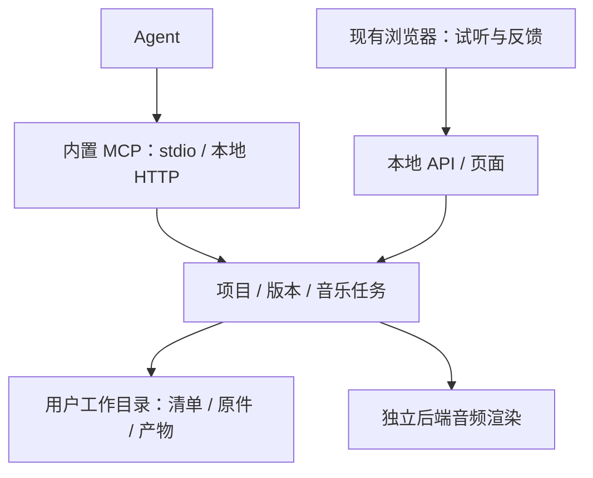

# Music Room 本地服务与单二进制

状态：当前开发方案，替代桌面客户端路线。2026-10-08。

## 产品与架构

一个可执行文件包含 TypeScript 本地服务、前端页面、基础音色与 MCP。用户用已有浏览器听评，agent 用 MCP 调用服务；不引入 Electron 或另一份 Chromium。普通项目文件夹是长期存储，支持短乐句、扩写、父子版本与独立反馈。

确定采用 Bun 的单文件编译、现有 TypeScript/Vite 前端及官方 MCP TypeScript SDK。服务领域规则使用 Node 兼容 API；Bun 仅是交付运行时，用户不需要安装 Bun/Node。二进制也包含运行时，实际体积在交付时记录，不承诺任意小的文件。[Bun 单文件编译](https://bun.sh/docs/bundler/executables)、[MCP SDK](https://ts.sdk.modelcontextprotocol.io/index.html)。

后端音频渲染必须不依赖打开浏览器；音色与浏览器音乐规则尽量复用，效果处理的差异须明示并用真实 WAV 验证。MCP 与网页使用同一服务，不自动执行上传的 JS/Python。Agent 在自己的环境运行作曲代码，交付乐谱。

音频识谱、视频处理和 YuE2 是后续可选引擎；本轮不安装大模型，不以这些引擎、签名、更新服务或云端鉴权作为基础开发门禁。当前基础版本交付的是乐谱创作、版本管理、渲染及听评闭环。

## 本地存储

工作目录持有独占服务锁。`projects/<id>/project.json` 保存项目身份、要求、默认版本和版本索引；`revisions/<id>/score.json` 保存创作格式原件。新版本可以指定同项目父版本。重复 ID、标题冲突或父版本错误返回失败，不覆盖。

每版以 SHA-256 验证原件；提交采用临时文件、文件同步和原子清单更新，失败只清理尚未发布的版本。衍生音频使用任务唯一 ID 追加，不覆盖旧产物。反馈保存在项目内单独文件。路径限制在工作目录，内部符号链接拒绝。移动工作目录后相对引用有效。

## 开发轮次

各轮顺序：失败场景与验证 → 实现 → review → 修复 → 验证 → 提交。整个 goal 在以下四轮全部通过后结束。

| 轮次 | 边界 | 完成证据 |
| --- | --- | --- |
| R1 项目服务 | 项目、版本、父版、反馈、事务、锁、恢复 | 真实写盘、并发、失败回滚、迁移、原件变更测试 |
| R2 后台渲染与任务 | 无网页音色渲染、任务快照/查询/取消/中断、产物 | 真实可听 WAV、音高/时长/波形、重启及取消验证 |
| R3 MCP 与页面 | 官方协议 stdio/HTTP、共享服务接口、前端持久库、导入、刷新、反馈 | MCP 客户端实际建项目/导入/渲染，浏览器实际显示和试听 |
| R4 二进制交付 | 页面/音色内嵌、连接说明、独立运行、回归、体积 | 源码目录外仅凭二进制运行、MCP 全流程、页面/音频与现有回归通过 |

原作品 WAV/MIDI 和用户 `compositions/` 不改动。单二进制不收进开发截图和重复大音频；前端需如实区分现有原始成品与新渲染产物，不能出现指向缺失文件的下载按钮。

更详细的长期产品流程、可选媒体引擎与模型边界见[桌面阶段设计](desktop-client.md)，其中 Electron 和 IPC 等外壳方案已被本文替代。

## 后端基础渲染器

`sample-pcm-v1` 在独立子进程读取原音色，完成采样移调、合成乐器、力度包络、声像、滤波、房间延迟、峰值限制及 PCM WAV 编码。钢琴 MP3 采用 `mpg123-decoder`，弦乐/长笛 WAV 采用 `wav-decoder`，无需浏览器、FFmpeg 或模型。合成音色代码与网页共用。

它与浏览器的卷积混响、动态压缩器不是逐采样相同的引擎；任务记录引擎身份，后端产物不会冒充原始成品。当前后端渲染器输出固定 44.1 kHz / 双声道 / 16 位 WAV，保留原曲时长和末尾淡出。默认混音可以通过任务参数固定；不提升小音量混音的响度。

单次渲染串行执行，输入乐谱与混音提交时固定。任务状态与输入快照落盘，同键同请求复用任务，同键不同请求拒绝。取消等待子进程结束；开始原子产物提交后不再撤销提交。退出将未完成任务标为中断，重启不自动重跑昂贵任务。成功必须经过 WAV 时长/格式/峰值检查与产物保存。

## MCP、API 与浏览器入口

内置官方 MCP SDK：`mcp` 命令通过 stdio 提供协议，日志只写 stderr；浏览器服务另提供带本地令牌的 `/mcp` Streamable HTTP 入口。两者共享同一工作目录内的单一服务和领域规则。stdio 先连接已有服务，不存在时启动；关闭由它启动的服务连接将中断未完成任务，关闭复用连接不会停止别人的服务。

工具覆盖状态、项目列表/创建/读取、创作资料、乐谱校验、版本导入/读取、渲染、任务列表/查询/取消和反馈。`music-room://authoring/guide` 为独立格式资源。没有自然语言关键词路由或任意 shell 执行入口。网页使用同一套带参数校验的 `/api/<operation>`，不是另一份存储和任务实现。[MCP 传输规范](https://modelcontextprotocol.io/specification/2025-11-25/basic/transports)。

HTTP 仅监听 127.0.0.1，验证 Host/Origin，受保护操作需要随机访问令牌。运行描述文件在工作目录中采用私有权限保存地址与令牌；日志、版本原件不包含令牌。stdio 配置只需要可执行文件路径与工作目录，不必手动复制每次启动的令牌。

网页在服务模式下读取磁盘作品，定时发现 agent 新版本；拖拽 MIDI/JSON、明确选择父版、查看/取消后台任务、播放已保存 WAV 和写听评。反馈草稿按版本区分。原静态网页模式继续使用浏览器副本；服务模式不把持久数据写进 localStorage。识谱、媒体导入和生成模型暂未实现，状态中如实报告不可用。
